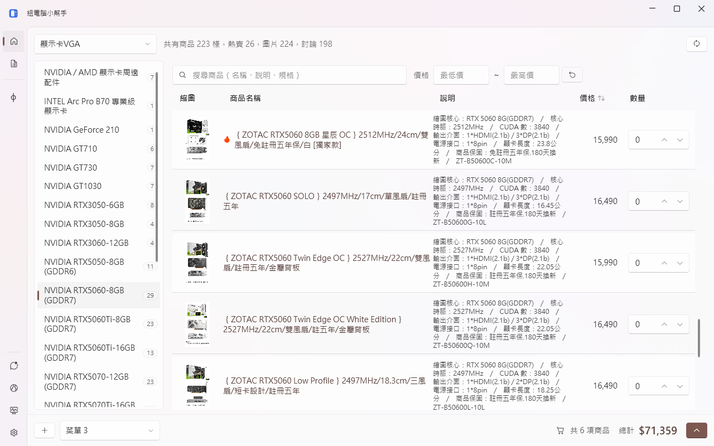
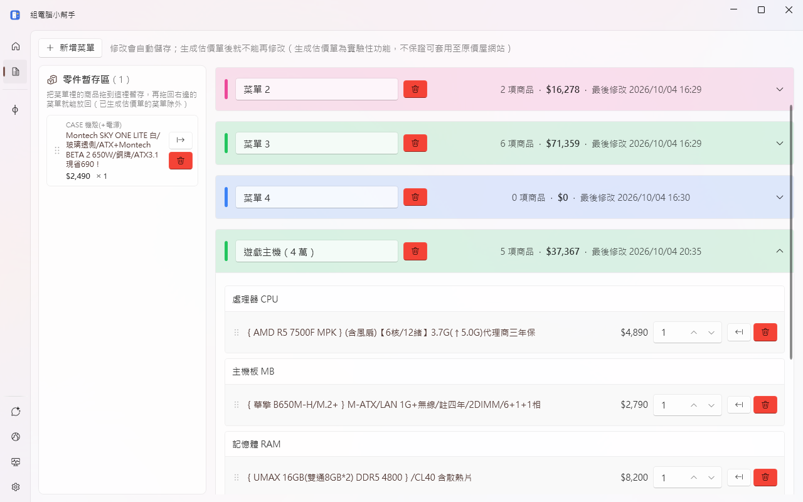
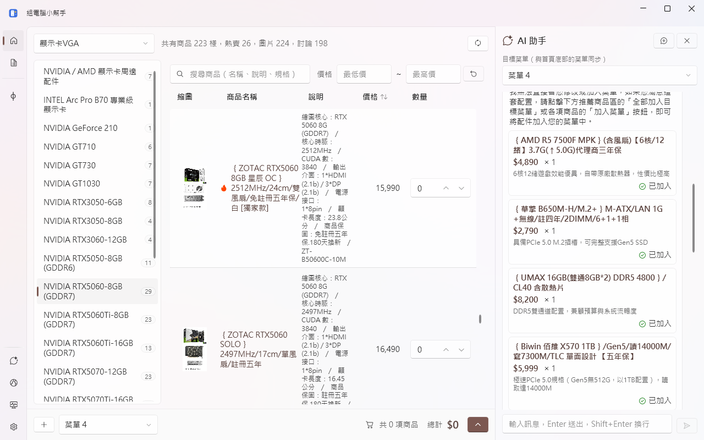
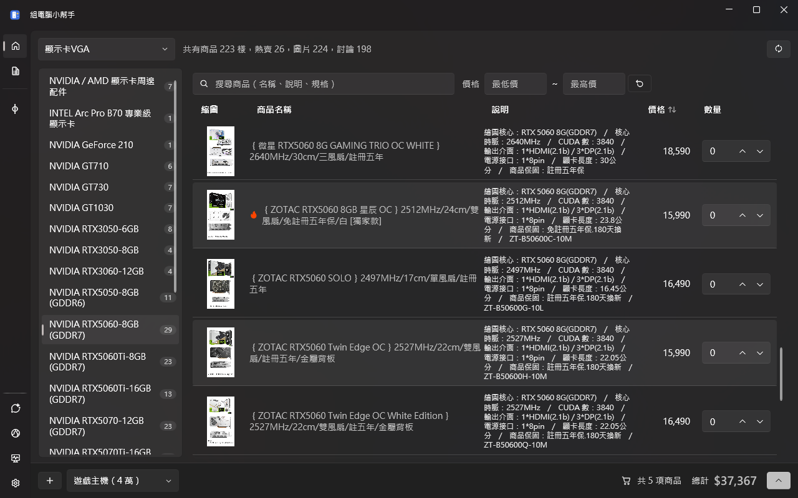

# 組電腦小幫手（PCBuilder）

Windows 桌面版的電腦組裝與比價小幫手。瀏覽[原價屋](https://www.coolpc.com.tw/evaluate.php)的商品、把想買的零件組成「菜單」計算總價，一鍵產生原價屋估價單；也可以問內建的 AI 助手，請它依預算推薦整台主機的配置。

> 商品價格僅供參考，實際價格與庫存以原價屋官網為準。本程式與原價屋沒有任何關係。

## 畫面

| 首頁 | 菜單管理與零件暫存區 |
|:---:|:---:|
|  |  |
| **AI 助手** | **深色模式** |
|  |  |

## 功能

### 商品瀏覽（首頁）
- 依主分類、子分類瀏覽原價屋的商品，熱賣商品會標示 🔥
- 搜尋商品名稱、說明、規格，並可設定價格區間
- 點「價格」欄標題排序：低→高、高→低、恢復原本順序
- 滑鼠移到縮圖上顯示大圖；點商品名稱在 App 內的瀏覽視窗開啟商品頁
- 直接在表格輸入數量，把商品加入目前的菜單；已加入的商品整列標示綠色

### 菜單與估價單
- 可以建立多個菜單（例如「預算版」「高階版」），底部即時顯示件數與總金額
- 一鍵把菜單送到原價屋產生估價單網頁與圖片（實驗性功能，不保證一定能套用）
- 生成估價單後菜單即鎖定，不能再修改

### 菜單管理
- 每個菜單有自己的代表色，收合時標題列也看得到商品數、總金額與最後修改時間
- 直接修改菜單名稱、商品數量，修改會自動儲存
- **零件暫存區**：把菜單裡的商品拖到左邊暫存，之後再拖回任一個菜單（同一個商品會合併數量）；也可以用按鈕搬移。暫存區存在資料庫，關閉 App 也不會不見

### AI 助手
- 使用 Google Gemini，可以直接說「預算 4 萬組一台 1080p 遊戲主機」
- AI 會參考原價屋目前的商品與價格、你的電腦硬體，以及目標菜單裡已有的商品
- 推薦的商品可以單項加入、全部加入目標菜單，或直接建立新菜單
- 對話會自動保存，重開 App 可以接著聊；訊息文字可選取，也可一鍵複製（含推薦清單與合計）
- 需要自行申請 Gemini API Key（見下方「AI 助手設定」）

### 其他
- **我的電腦**：查看本機 CPU、主機板、記憶體、顯示卡、硬碟等硬體資訊，作為升級參考（溫度等感測器數值需要安裝 [PawnIO](https://pawnio.eu/) 並以系統管理員身分執行才會顯示）
- **相關連結**：CPU / 顯示卡效能天梯圖、電腦組裝模擬器
- 淺色 / 深色主題
- 啟動時先顯示上次的商品資料，背景自動更新；也可以手動更新

## 系統需求

- Windows 10 / 11（64 位元）
- [.NET 10 Desktop Runtime](https://dotnet.microsoft.com/download/dotnet/10.0)
- [Microsoft Edge WebView2 Runtime](https://developer.microsoft.com/microsoft-edge/webview2/)：App 內瀏覽商品頁使用，Windows 11 已內建；沒有安裝時會改用系統預設瀏覽器開啟
- 網路連線（更新商品資料、AI 助手、產生估價單）

## 下載

之後會在 [GitHub Releases](https://github.com/Gusty1/PCBuilder/releases) 發布安裝檔，App 的「設定」頁可以檢查是否有新版本。目前尚未發布，請先依下方說明從原始碼建置。


也可以用 Visual Studio 開啟 `PCBuilder.slnx` 直接執行。

## AI 助手設定

1. 到 [Google AI Studio](https://aistudio.google.com/app/apikey) 登入 Google 帳號，建立一組 Gemini API Key
2. 開啟 App 的「設定」頁，在「AI 設定」貼上 API Key 並儲存
3. 點左側的「AI 助手」開始對話

API Key 會以 Windows DPAPI 加密後存在本機，只有目前的 Windows 帳號能解開。免費額度有每分鐘、每日的使用上限，用完時 AI 助手會提示稍後再試。

## 資料存放位置

所有資料都存在 `%LocalAppData%\PCBuilder`：

| 檔案 | 內容 |
|------|------|
| `PCBuilder.db3` | 商品資料、菜單、零件暫存區、加密後的 API Key（SQLite） |
| `preferences.json` | 偏好設定（主題、上次選的分類與菜單等） |
| `ai-chat.json` | 目前這段 AI 對話 |
| `PCBuilder.log` | 錯誤記錄，回報問題時可以附上 |
| `WebView2\` | App 內瀏覽視窗的快取 |

「設定」頁的「清除所有資料」會刪除全部菜單、零件暫存區與偏好設定。要完全重置，關閉 App 後刪除整個資料夾即可。

## 技術架構

| 項目 | 使用技術 |
|------|----------|
| 框架 | WPF（.NET 10） |
| UI | [WPF UI](https://github.com/lepoco/wpfui)（Fluent 風格） |
| MVVM | CommunityToolkit.Mvvm |
| 資料庫 | SQLite + Entity Framework Core 10 |
| 相依注入 / HTTP | Microsoft.Extensions.Hosting、Microsoft.Extensions.Http |
| 內嵌瀏覽器 | Microsoft Edge WebView2 |
| 硬體資訊 | LibreHardwareMonitorLib、System.Management |
| AI | Google Gemini API |

商品資料由另一個爬蟲專案整理原價屋的商品後，發布在 `https://gusty1.github.io/Database/coolPC/product.json`，App 下載後存進本機資料庫。

```
PCBuilder/
├── App.xaml(.cs)            # 進入點：Host 建立、相依注入註冊
├── MainWindow.xaml(.cs)     # 主視窗：導覽列、AI 側邊欄
├── Assets/                  # 圖示、游標、替代圖片（build-icon.ps1 產生 app.ico 與 grab.cur）
├── Converters/              # XAML 值轉換器
├── Data/                    # EF Core DbContext
├── Models/                  # 資料庫實體、DTO、硬體資訊模型
├── Services/                # 商品資料、菜單、AI、硬體掃描、設定等服務
├── ViewModels/              # 各頁面的 ViewModel
└── Views/                   # 頁面、對話框與共用控制項
```

## 意見回饋

歡迎到 [GitHub Issues](https://github.com/Gusty1/PCBuilder/issues) 回報問題或提出建議，也可以使用 App「設定」頁的「意見回饋」寄信給作者。回報錯誤時附上 `%LocalAppData%\PCBuilder\PCBuilder.log` 會更容易找到原因。
